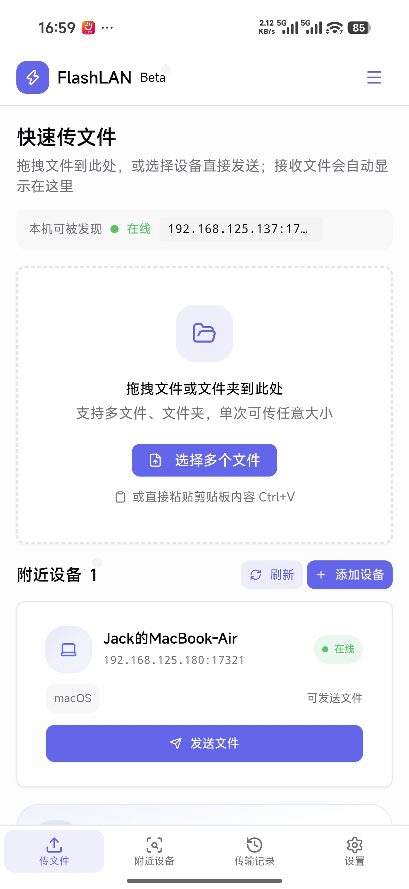
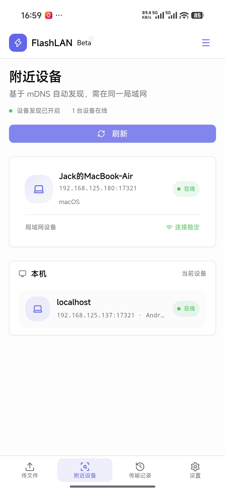
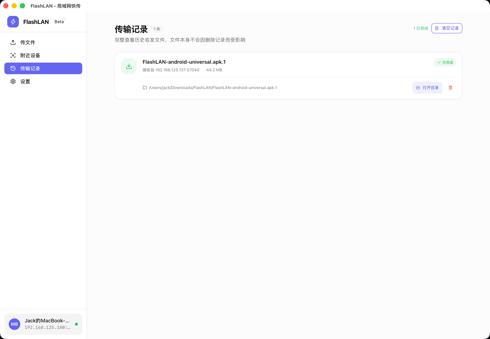
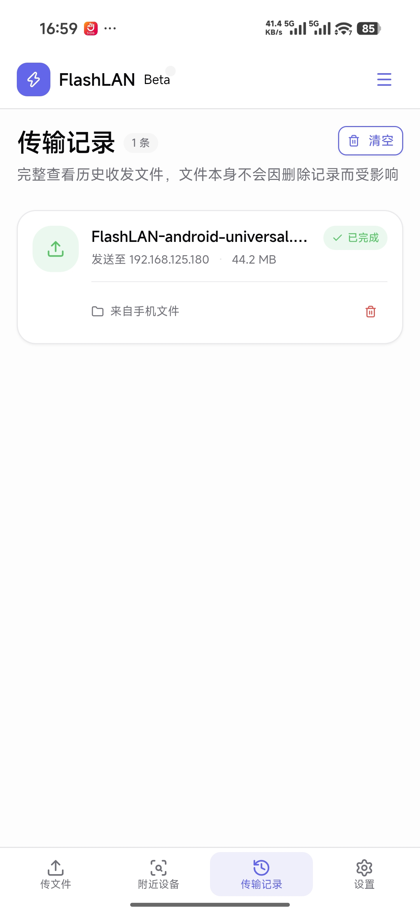
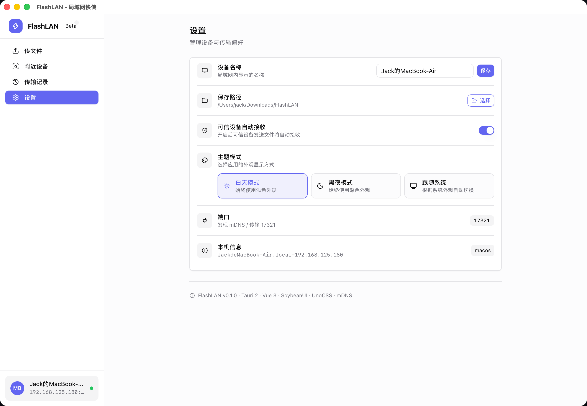
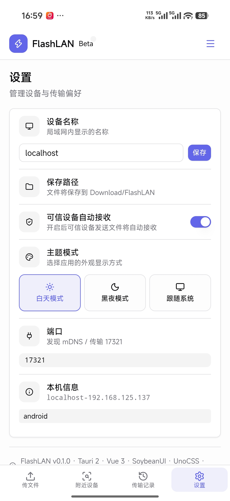

# FlashLAN

局域网快传应用。基于 Tauri 2、Vue 3 和 Rust，在同一局域网内发现设备，并通过加密连接传输文件和文字消息。

> 当前版本：`0.2.0` · Beta

## v0.2.0 更新

- 新增基于 TLS 和设备指纹的安全连接，支持二维码配对与可信设备管理
- 新增局域网文字消息，支持设备会话、消息复制、单条删除以及按设备或全部清空记录
- 改进附近设备管理，支持设备别名、在线状态、移动端操作和更清晰的传输命名
- 修复传输核心稳定性问题，优化 macOS 应用与托盘图标尺寸，并调整深色模式边框显示

## 功能

- 通过 mDNS 自动发现同一局域网内运行 FlashLAN 的设备
- 支持手动添加设备 IP 和端口，并在发送前测试连接
- 支持二维码配对、设备指纹校验和可信设备管理
- 支持选择多个文件发送，显示传输进度、速度和状态
- 接收文件前弹窗确认，也可以在设置中开启自动接收
- 支持通过加密连接发送局域网文字消息，并在本机保存消息记录
- 查看、删除和清空传输记录
- 自定义设备名称、接收保存目录和主题模式
- Android 接收文件时优先保存到公共 `Download/FlashLAN` 目录
- 支持桌面端和 Android；浏览器模式可用于预览界面

## 界面预览

### 桌面端与 Android

| 桌面端                                                                                | Android                                                                                 |
| ------------------------------------------------------------------------------------- | --------------------------------------------------------------------------------------- |
|   |   |
|  |  |
|  |  |
|     |     |

## 技术栈

| 层级            | 技术               |
| --------------- | ------------------ |
| 桌面 / 移动端   | Tauri 2            |
| 前端            | Vue 3 + TypeScript |
| 构建工具        | Vite 6             |
| UI              | SoybeanUI + UnoCSS |
| 状态管理        | Pinia              |
| 路由            | Vue Router         |
| 网络服务        | Rust + Tokio       |
| 设备发现        | `mdns-sd`          |
| 安全连接        | TLS + 设备指纹     |
| 文件 / 消息传输 | TCP                |
| 包管理          | pnpm               |

## 环境要求

- Node.js
- pnpm
- Rust toolchain（包含 Cargo）
- Tauri 2 的桌面端构建依赖
- 构建 Android 时还需要 Android Studio、Android SDK/NDK 和 JDK

首次使用可以先确认 Tauri 环境：

```bash
pnpm install
pnpm tauri info
```

## 快速开始

### 浏览器预览

```bash
pnpm install
pnpm dev
```

浏览器预览使用模拟设备和模拟文件选择，不会启动 Rust 文件服务，也不能进行真实的局域网传输。

### Tauri 桌面开发

```bash
pnpm install
pnpm tauri dev
```

启动后，在“附近设备”页面扫描设备，或在首页手动添加目标设备的 IP 地址和端口。默认端口为 `17321`。

## 常用命令

| 命令                 | 说明                            |
| -------------------- | ------------------------------- |
| `pnpm dev`           | 启动 Vite 浏览器预览            |
| `pnpm tauri dev`     | 启动 Tauri 桌面开发环境         |
| `pnpm build`         | 类型检查并构建前端              |
| `pnpm tauri build`   | 构建当前平台的 Tauri 安装包     |
| `pnpm build:macos`   | 构建 macOS DMG                  |
| `pnpm build:windows` | 构建 Windows NSIS 和 MSI 安装包 |
| `pnpm build:android` | 构建 Android APK                |
| `pnpm preview`       | 预览已构建的前端产物            |
| `pnpm check`         | 执行类型检查、Lint 和格式检查   |
| `pnpm typecheck`     | 仅执行 TypeScript/Vue 类型检查  |
| `pnpm lint:check`    | 仅执行 Lint 检查                |
| `pnpm fmt:check`     | 仅执行格式检查                  |
| `pnpm fmt`           | 格式化项目文件                  |

## 传输实现

### 设备发现

应用启动时会在 mDNS 注册 `_flashlan._tcp.local.` 服务，并通过该服务广播设备名称、平台、设备 ID 和地址。扫描时会过滤当前设备，因此发送端和接收端只需要连接到同一个局域网。

### 文件传输

- TCP 监听端口固定为 `17321`
- 建立连接后，发送端先发送一行 JSON 文件头：`file_name`、`file_size`、`task_id`
- 接收端返回 `ACCEPT` 或 `REJECT`
- 接收端确认后开始传输文件内容，并以事件形式上报进度和速度
- 接收完成后，接收端发送 `OK` 确认

前端使用以下 Tauri 事件更新任务状态：

- `transfer_request`：收到待确认的传输请求
- `transfer_started`：传输开始
- `transfer_progress`：传输进度和速度
- `transfer_complete`：传输完成或失败

如果设备发现不到，请确认两台设备在同一局域网，并允许应用通过防火墙访问 TCP `17321` 和局域网 mDNS 流量。也可以使用首页的“手动添加设备”功能直接连接。

## 文件保存位置

- macOS、Windows、Linux：默认保存到系统下载目录下的 `FlashLAN` 文件夹，可在“设置”中修改
- Android 10 及以上：优先写入公共 `Download/FlashLAN`，完成后生成可由系统文件管理器打开的 URI
- Android 较旧版本或 MediaStore 不可用时：回退到应用数据目录

设置和传输历史保存在应用本地；清空历史只会删除记录，不会删除已经传输的文件。当前最多保留 100 条已完成或失败的记录。

## 项目结构

```text
FlashLAN/
├── src/
│   ├── layouts/           # 主布局、导航和接收确认弹窗
│   ├── views/             # 传文件、附近设备、传输记录、设置页面
│   ├── stores/            # Pinia 状态：设备和传输任务
│   ├── router/            # Vue Router 路由
│   ├── ui/                # SoybeanUI 组件和主题
│   ├── utils/             # Tauri / 平台判断等工具
│   ├── styles/            # 全局样式
│   ├── App.vue
│   └── main.ts
├── src-tauri/
│   ├── src/lib.rs         # Tauri 初始化、设置和命令注册
│   ├── src/discovery.rs   # mDNS 注册与设备发现
│   ├── src/transfer.rs    # TCP 文件服务、发送和接收
│   ├── capabilities/      # Tauri 权限配置
│   ├── icons/              # 应用图标
│   ├── Cargo.toml
│   └── tauri.conf.json
├── public/                # 静态资源
├── uno.config.ts          # UnoCSS 配置
├── vite.config.ts         # Vite、Vue 和 SoybeanUI 配置
├── sbean.json             # SoybeanUI 配置
└── package.json
```

## Tauri 命令

Rust 端当前注册的主要命令如下：

| 命令                            | 作用                         |
| ------------------------------- | ---------------------------- |
| `get_device_info`               | 获取本机设备信息             |
| `get_settings`                  | 获取应用设置                 |
| `set_device_name`               | 更新设备名称并刷新 mDNS 服务 |
| `set_save_path`                 | 更新接收文件保存目录         |
| `discover_devices`              | 扫描附近 FlashLAN 设备       |
| `test_connection`               | 测试目标设备的 TCP 连接      |
| `send_file`                     | 向目标设备发送文件           |
| `open_file_location`            | 打开文件或文件所在目录       |
| `respond_transfer_request`      | 接受或拒绝接收请求           |
| `get_pending_transfer_requests` | 获取待处理的接收请求         |
| `set_auto_receive`              | 开关自动接收                 |

## SoybeanUI

项目通过 `sbean` 管理部分 UI 组件。常用命令：

```bash
# 查看可用组件
pnpm exec sbean list

# 添加组件
pnpm exec sbean add button card dialog input

# 查看组件源码
pnpm exec sbean view button
```

## 当前限制

- 当前 Rust 传输层只处理文件，文件夹传输尚未实现
- 浏览器预览不具备真实的 mDNS、TCP 传输和本机目录访问能力
- 设备发现依赖局域网 mDNS；跨网段或禁用组播的网络需要手动添加设备
- 发送端必须能访问接收端的 TCP `17321` 端口

## 后续计划

- [ ] 文件夹递归传输
- [ ] 拖拽和剪贴板内容的完整接入
- [ ] 系统托盘与桌面通知
